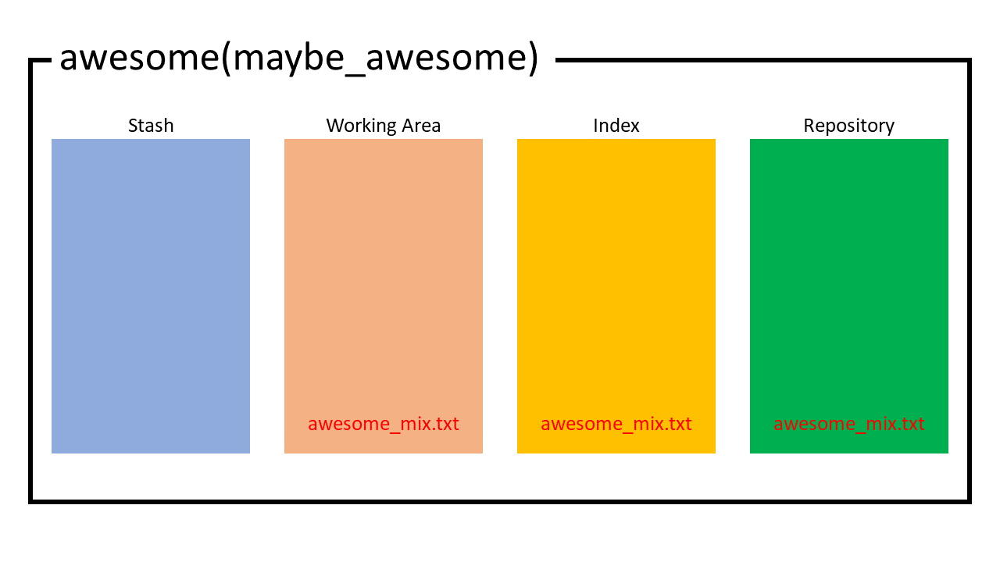
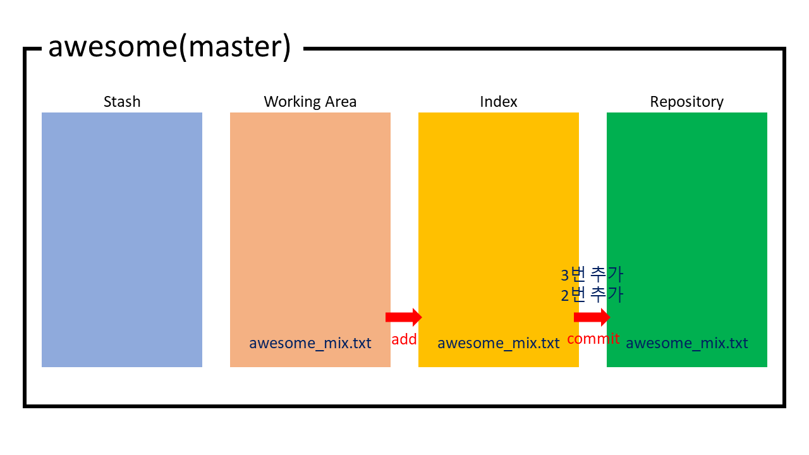

<!-- @format -->

# git 마스터

_기초적인 사용법_

[누구나 쉽게 이해할 수 있는 Git 입문](https://backlog.com/git-tutorial/kr/intro/intro1_1.html)

_필수 코스_

[git은 어떻게 동작하는가?]()

---

## 챕터

## 0. 도입

<br/>

## 1. 네 개의 영역

-   ### 1.1. git add는 무엇을 하는가
-   ### 1.2. Working Area / Index / Repository / Stash
-   ### 1.3. git add(Working Area -> Index)
-   ### 1.4. git commit(Index -> Repository)
-   ### 1.5. git checkout(Working Area <- Index && Working Area <- Repository)
-   ### 1.6. git reset(Repository -> Index || Repository -> Working Area)
-   ### 1.7. git rm/mv
-   ### 1.8. git switch/restore
-   ### 1.9. 정리
<br/>

## 2. Stash

-   ### 2.1. 임시저장소
-   ### 2.2. git stash
-   ### 2.3. 정리

<br/>

## 3. Revision Parameter

-   ### 3.1. HEAD의 두 단계 전 커밋의 두 번쨰 부모를 보고 싶어
-   ### 3.2. git blame
-   ### 3.3. git log
-   ### 3.4. 정리

<br/>

## 4. 마치며

<br/>

---

## 0. 도입

<div style="text-indent :1rem">본문은 이전 코스 'git은 어떻게 동작하는가?'에 이어지는 내용이다. 해당 코스의 내용을 모른다면 본문의 내용을 이해할 수 없으니 반드시 정독하고 오길 바란다.</div>

<div style="text-indent :1rem">git을 사용하는 중 무언가 잘 되지 않아 받은 소스를 전부 지우고 다시 clone한 적이 있는가? 아니면 무언가 해보려다가 오히려 소스 저장소만 망쳐서 아예 저장소를 지우고 새로 만든 적이 있는가? 본문에서는 이런 일에 대한 해결책을 중점적으로 다룬다. 이전보다는 조금 더 실전적인 내용을 다룰 것이고, 이전 내용을 잘 익혔다면 이미 git의 동작원리를 알고 있으므로 제목만큼 거창하게 어려운 내용은 없을 것이다.</div>

## 1. 네 개의 영역

<div style="text-indent :1rem">이전에 git을 양파에 비유했다. 이제는 git의 구조에 대해서, 보다는 git이 하는 실제 작업에 대해서, 로 관점을 바꿀 것이다. 전자가 은유였다면 후자는 실제다.</div>


<div style="margin-bottom : 3rem;  text-align : center">네 개의 영역</div>

<br/>
<div style="text-indent :1rem">git은 작업할 때 실제로 위처럼 네 개의 영역(Stash, Working Area, Index, Repository)을 사용한다. 차근차근 살펴보자.</div>

### 1.1. git add는 무엇을 하는가

<div style="text-indent :1rem">git log나 git status 등의 부가적인 헬퍼 커맨드 외에 우리가 git 워크플로우에서 일상적으로 사용하는 add, commit, push, pull 등의 커맨드에 대해 생각해보자. 해당 커맨드가 무엇을 하는지 정확히 알고 있는가? 잘 모른다면 아마 다음처럼 생각할 지도 모르겠다.</div>

> "add는 잘 모르겠지만 commit 전에 해야하고...... 귀찮지만 git add . 으로 한 번에 할 수 있어"

> "commit도 잘 모르겠지만 해야 소스코드도 저장도 하고 원격 저장소에 올릴 수 있어"

<div style="text-indent :1rem">안타깝게도 git 초심자들은 자기가 뭘 하는지도 모르면서 그냥 그러려니 하고 쓰는 경우가 많다. 이 떄문에 세간에는 git은 쓰기는 쉬워도 배우기는 어렵다는 말이 돌고 있다.</div>

<div style="text-indent :1rem">해당 커맨드가 하는 동작은 위에서 본 네 개의 영역간 데이터를 그저 '복사'하는 것이다. '복사'이라는 단어에 주목하길 바란다. 우선 네 개의 영역에 대해 알아보자.</div>

### 1.2. Working Area / Index / Repository / [Stash]


<div style="margin-bottom : 3rem;  text-align : center">네 개의 영역</div>

<br/>
-   Working Area

<div style="text-indent :1rem">Working Area는 당신이 작업하는 디렉토리를 말한다. 사용자에겐 작업중인 중요한 공간이지만, git 저장소 입장에서는 일시적인 저장소에 불과하다.</div>

-   Index

<div style="text-indent :1rem">Index는 Working Area와 Repository 중간에 위치하는 저장소이다. git add 커맨드가 하는 동작이 바로 Working Area에서 Index로 파일을 복사 하는 것이다. 해당 영역을 통해 실제 저장소에 반영할 내용을 필터링 할 수 있다.</div>

-   Repository

<div style="text-indent :1rem">Repository는 git 저장소를 의미한다. git commit 커맨드가 하는 동작이 바로 Index에서 Repository로 파일을 복사 하는 것이다. 해당 영역에는 커밋, 트리, blob 등 git 오브젝트가 존재하며 해당 오브젝트는 값을 변경할 수 없다. .git 폴더 자체가 해당 영역을 의미한다.</div>

-   Stash

<div style="text-indent :1rem">git의 임시 저장소이며, git stash로 다룰 수 있다. Stash는 위 세가지 영역과 다른 성격을 띄므로 여기가 아닌 별도의 챕터에서 설명할 것이다.</div>

### 1.3. git add(Working Area -> Index)

```bash
$mkdir awesome
$cd awesome
$git init
$echo "1. I am the walrus - The Beatles" >> awesome_mix.txt
$git diff
$git add awesome_mix.txt
$git diff
$rm awesome_mix.txt
$git diff
diff --git a/awesome_mix.txt b/awesome_mix.txt
deleted file mode 100644
index 0aa8148..0000000
--- a/awesome_mix.txt
+++ /dev/null
@@ -1 +0,0 @@
-1. I am the walrus - The Beatles
$git status
On branch master

No commits yet

Changes to be committed:
  (use "git rm --cached <file>..." to unstage)
        new file:   awesome_mix.txt

Changes not staged for commit:
  (use "git add/rm <file>..." to update what will be committed)
  (use "git restore <file>..." to discard changes in working directory)
        deleted:    awesome_mix.txt
```

<div style="text-indent :1rem">일단, 처음 보는 커맨드가 보인다. git diff는 세 개의 영역간이나 커밋 간의 차이를 보여주는 커맨드이다. 아무 옵션을 붙이지 않으면 Working Area와 Index 간의 차이를 보여준다. 저장소를 갓 만들었을 때는 Index의 내용물이 없기 때문에 아무런 반응이 없다. 이후 awesome_mix.txt를 add 커맨드로 더해준다. 이후에 git diff를 쳐도 당연히 두 저장소의 상태가 같으므로 아무런 출력도 나오지 않는다. 하지만 Working Area에서 직접 파일을 지우고 비교를 해주면 예시처럼 Working Area와 Index 간의 차이를 보여준다(Working Area에서는 awesome_mix.txt가 삭제되었다).</div>

<div style="text-indent :1rem">git status로도 현재 저장소의 상태를 볼 수 있다. 여기서 staged/unstaged라는 말이 나오는데 staged는 Working Area에 있던 파일이 Index로 복사된 상태를 의미하고, unstaged는 Working Area에만 Index와는 다른 상태의 파일이 존재하는 상태를 의미한다. 친절하게 되돌리는 방법도 같이 나와있으니 무언가 곤란할 때는 git status를 통해 해결책을 구하는 것도 좋은 생각이다.</div>

<div style="text-indent :1rem">그렇다면 Working Area에 존재하지 않고, Index에만 있는 awesome_mix.txt를 다시 Index에서 Working Area로 복사할 수 있을까? 가능하다. 곧 자세히 다루겠지만 git checkout과 git restore로 할 수 있다. 여기서는 할 수 있다는 것만 보이도록 하겠다.</div>

```bash
#awesome_mix.txt를 Index로부터 Working Area로 복구
$git checkout awesome_mix.txt
$git diff
$git status
On branch masterm

No commits yet

Changes to be committed:
  (use "git rm --cached <file>..." to unstage)
        new file:   awesome_mix.tx
```

<div style="text-indent :1rem">다시 원상태로 복구 되었다. git을 자유롭게 다룬다는 것은 결국 git 저장소 네 개의 영역 내의 데이터를 자유롭게 이동 시킬 수 있는 능력이 있다는 걸 의미한다. 따지고 보면 파일 탐색기를 이용해 폴더 네 개에서 파일을 왔다갔다 하는 것과 차이가 없다. 여기선 커맨드라인을 이용했지만 Sourcetree등의 GUI 툴을 이용하면 정말 그것과 차이가 없다. 일련의 과정을 그림으로 표현하면 다음과 같다.</div>


<div style="margin-bottom : 3rem;  text-align : center">초기 상태(awesome_mix.txt 추가)</div>

<br/>

<div style="margin-bottom : 3rem;  text-align : center">git add awesome_mix.txt</div>

<br/>

<div style="margin-bottom : 3rem;  text-align : center">rm awesome_mix.txt</div>

<br/>

<div style="margin-bottom : 3rem;  text-align : center">git checkout awesome_mix.txt</div>

<br/>
<div style="text-indent :1rem">추가적으로 본 예시에서는 git add시에 파일 이름을 직접 지정했다. 대부분의 시나리오에서 작업 중인 모든 파일을 Index로 옮기는 'git add .'가 유효하지만 직접 파일을 지정하면서 add를 하면 좀 더 유연하게 git을 다룰 수 있다. 번거롭더라도 'git add .'를 사용하는 것은 자제하기 바란다. GUI 툴을 사용한다면 대개 마우스 클릭이나 드래그로 직접 staged 될 파일을 고를 수 있으므로 커맨드라인처럼 파일 이름을 다 적는 번거로움은 없을 것이다.</div>

### 1.4. git commit(Index -> Repository)

```bash
$git diff --cached
diff --git a/awesome_mix.txt b/awesome_mix.txt
new file mode 100644
index 0000000..0aa8148
--- /dev/null
+++ b/awesome_mix.txt
@@ -0,0 +1 @@
+1. I am the walrus - The Beatles
$git commit -m "첫 곡 추가"
$git diff --cached # Repository - Index 비교
$git diff # Index - Working Area 비교
```

<div style="text-indent :1rem">이 번엔 git diff에 --cached 옵션을 추가했다. --cached 옵션을 추가하면 Repository와 Index를 비교한다. 메시지를 보면 Repository에는 아무것도 없는데 Index에는 awesome_mix.txt가 추가 되었다고 말하고 있다. 이 상태에서 커밋을 진행하면 Index의 내용이 Repository로 복사된다. 그러면 세 개의 영역이 모두 동일한 내용을 갖게 되므로 git diff를 해도 동일한 결과를 얻는다.</div>


<div style="margin-bottom : 3rem;  text-align : center">git commit -m "첫 곡 추가"</div>

<br/>
### 1.5. git checkout(Working Area <- Index && Working Area <- Repository)

<div style="text-indent :1rem">중요한 건 지금부터다. 워크플로우의 순방향으로 이어지는 add와 commit은 동작에 대해 딱히 잘 알지 못 하더라도 어느정도 사용할 수 있다. 하지만, 그 역에 대해서 사람들은 몹시 곤란해한다. 도입에서 말한 것처럼, 무언가 잘못되어 저장소를 지우고 다시 clone을 하거나 새로 만든 적이 있지는 않은가? 본문의 내용의 중점이 바로 그 해결책에 있다. 여기서 다룰 git checkout은 그 시발점이다.</div>

<div style="text-indent :1rem">이제껏 git checkout을 브랜치를 변경할 때 사용했지만, 사실, git checkout의 man 페이지를 보면 "브랜치를 변경하거나, 워킹 트리 파일을 복구(Switch branches or restore working tree files)한다."라고 적혀있다. 파일을 복구할 때도 쓰인다는 의미다. 여기서 워킹 트리는 Working Area를 의미한다. 사실 git은 리누스가 개인 필요로 만든 프로그램이라 커맨드들이 그다지 직관적이지 않다. 요즘에는 git이 대중적으로 알려지고 오픈소스 개발 커뮤니티도 거대해졌기에 이를 보완하는 직관적인 커맨드들이 많이 추가되었다. 이런 커맨드들도 곧 다룰 것이다.</div>

<div style="text-indent :1rem">git checkout으로 Index에서 Working Area로 파일을 복구하는 건 이미 봤으니 이제는 브랜치를 이동하면서 어떤 일이 벌어지는지 좀더 자세하게 알아보자.</div>

```bash
$git checkout -b maybe_awesome master # -b 옵션을 붙이면 브랜치를 만들고 이동한다.
Switched to a new branch 'maybe_awesome'
$echo "1. eye of the tiger - survivor" >> maybe_awesome.txt
$git add maybe_awesome.txt
$git commit -m "첫번째 곡 추가"
$ls
awesome_mix.txt  maybe_awesome.txt
$git checkout master
Switched to branch 'master'
$ls
awesome_mix.txt
```


<div style="margin-bottom : 3rem;  text-align : center">git checkout -b maybe_awesome master</div>

<br/>

<div style="margin-bottom : 3rem;  text-align : center">echo "1. eye of the tiger - survivor" >> maybe_awesome.txt</div>

<br/>

<div style="margin-bottom : 3rem;  text-align : center">git add maybe_awesome.txt</div>

<br/>

<div style="margin-bottom : 3rem;  text-align : center">git commit -m "첫번째 곡 추가"</div>

<br/>

<div style="margin-bottom : 3rem;  text-align : center">git checkout master</div>

<br/>
<div style="text-indent :1rem">이렇듯 git checkout은 뒤에 파일 이름이 오면 Index에서 Working Area로 파일을 복사하고, 뒤에 브랜치가 오면 Repository의 파일들을 Index와 Working Area로 복사한다.</div>

### 1.6. git reset(Index <- Repository || Working Area <- Repository)

<div style="text-indent :1rem">개인적으로 git에서 가장 유용한 커맨드가 아닌가 싶다. 앞서 소개한 checkout이 브랜치/커밋 이동과 동시에 Repository의 내용으로 Index/Working Area를 덮어씌운다면, reset은 선별적으로 Repository의 내용을 덮어씌울 수 있다. 혹은 데이터 복사 없이 HEAD만 이동할 수도 있다. git reset은 다음 두 연속동작으로 이루어져있다.</div>
<br/>

> -   git reset 동작순서

1. HEAD를 지정한 커밋으로 이동
2. 데이터 복사

<div style="text-indent :1rem">git reset의 다양한 동작은 아래 옵션들로 실현된다.</div>

<br/>

> git reset 데이터 복사 옵션

1. --hard

<div style="text-indent :1rem">Repository -> Index/Working Area.</div>
<br/>

2. --mixed(기본)

<div style="text-indent :1rem">Repository -> Index</div>
<br/>

3. --soft

<div style="text-indent :1rem">아무것도 안 함. 즉, 순수하게 HEAD만 이동(Repository만 바뀜).</div>
<br/>

<div style="text-indent :1rem">이제 예시를 살펴볼 것이다. 예시는 위에서 언급한 옵션 순서대로 전개될 것이다.</div>

```bash
$ls #master 브랜치
awesome_mix.txt
$git checkout maybe_awesome # Working Area/Index <- Repository(maybe_awesome)로 내용 복사
Switched to branch 'maybe_awesome'
$ls
awesome_mix.txt  maybe_awesome.txt
$git status
On branch maybe_awesome
nothing to commit, working tree clean
$rm awesome_mix.txt
$echo "덮어씌울 거야" >maybe_awesome.txt
$git add .
$git status
On branch maybe_awesome
Changes to be committed:
  (use "git restore --staged <file>..." to unstage)
        deleted:    awesome_mix.txt
        modified:   maybe_awesome.txt

[maybe_awesome 2e0fb04] 지워버렸어
 1 file changed, 1 deletion(-)
 delete mode 100644 awesome_mix.txt
$git reset --hard HEAD # Working Area/Index <- Repository로 내용 복사
HEAD is now at 385229a 첫번째 곡 추가
$ls
awesome_mix.txt  maybe_awesome.txt
$git status
On branch maybe_awesome
nothing to commit, working tree clean
```


<div style="margin-bottom : 3rem;  text-align : center">git checkout maybe_awesome</div>

<br/>

<div style="margin-bottom : 3rem;  text-align : center">rm awesome_mix.txt</div>

<br/>

<div style="margin-bottom : 3rem;  text-align : center">git add awesome_mix.txt</div>

<br/>

<div style="margin-bottom : 3rem;  text-align : center">git reset --hard</div>

<br/>
<div style="text-indent :1rem">위처럼 reset에 --hard 옵션을 붙이면 Repository의 내용을 Working Area와 Index로 복사한다. 말그대로 완벽히 reset 되는 셈이다. reset 뒤에는 커밋이나 브랜치를 붙여줘야하는데 HEAD는 알다시피 현재 브랜치 가리키는 것이다. 그러므로 현재 브랜치의 최신 커밋의 Repository 내용을 복사하는 것이다. 사실 HEAD는 기본값으로 브랜치 이름을 쓰지 않고 "git reset --hard"만 써도 동일한 동작을한다.</div>

```bash
$rm awesome_mix.txt
$git add .
$git commit -m "지워버렸어"
$git log --oneline
2e0fb04 (HEAD -> maybe_awesome) 지워버렸어
385229a 첫번째 곡 추가
9149e82 (master) 첫 곡 추가
$git reset --hard 385229a
HEAD is now at 385229a 첫번째 곡 추가
$ls
awesome_mix.txt  maybe_awesome.txt
$git log --oneline
385229a (HEAD -> maybe_awesome) 첫번째 곡 추가
9149e82 (master) 첫 곡 추가
```


<div style="margin-bottom : 3rem;  text-align : center">rm awesome_mix.txtt && git add . && git commit -m "지워버렸어"</div>

<br/>

<div style="margin-bottom : 3rem;  text-align : center">git reset --hard 385229a</div>

<br/>
<div style="text-indent :1rem">이처럼 이전 커밋으로 되돌리기 위해서 사용할 수도 있다. 이 때는 파라미터로 커밋 이름(키)가 와야한다. 이러면 HEAD가 이전에 가리키던 커밋은 커밋 트리로부터 떨어져(Detach) 어느순간 자동으로 삭제 될 것이다. 이렇게 --hard 옵션은 작업중이던 내역을 전부 지우고 새롭게 시작하거나, 커밋을 되돌리는 등의 동작을 할 때 사용된다. 이제 git 저장소를 지우고 다시 clone하지 말고 "git reset --hard"를 적극 활용하기 바란다. 물론 작업중인 내역이 날아가므로 신중하게 사용해야한다.</div>

<div style="text-indent :1rem">--mixed 옵션은 reset의 기본 옵션이라 붙이지 않고 사용해도 되지만 예시에서는 명확함을 위해 붙여서 사용하겠다.</div>

```bash
$echo "2. have you ever seen the rain - C.C.R" >>maybe_awesome.txt
$echo "1. livin' in the sunlight, lovin' in the moonlight - Tiny Time" >>new_awesome.txt
$git add maybe_awesome.txt
$ git status
On branch maybe_awesome
Changes to be committed:
  (use "git restore --staged <file>..." to unstage)
        modified:   maybe_awesome.txt

Untracked files:
  (use "git add <file>..." to include in what will be committed)
        new_awesome.txt
$git commit -m "maybe_awesome 2번째 곡"
[maybe_awesome 303ff8d] maybe_awesome 2번째 곡
 1 file changed, 1 insertion(+)
$git status
On branch maybe_awesome
Untracked files:
  (use "git add <file>..." to include in what will be committed)
        new_awesome.txt

nothing added to commit but untracked files present (use "git add" to track)
$git add new_awesome.txt
warning: LF will be replaced by CRLF in new_awesome.txt.
The file will have its original line endings in your working directory
$git status
On branch maybe_awesome
Changes to be committed:
  (use "git restore --staged <file>..." to unstage)
        new file:   new_awesome.txt
#생각해보니 new_awesome.txt은 지워야겠어!
$git reset --mixed HEAD #Repository -> Index
$git status
On branch maybe_awesome
Untracked files:
  (use "git add <file>..." to include in what will be committed)
        new_awesome.txt

nothing added to commit but untracked files present (use "git add" to track)
$ls #Working Area는 그대로
awesome_mix.txt  maybe_awesome.txt  new_awesome.txt
```


<div style="margin-bottom : 3rem;  text-align : center">Working Area 수정(echo ~ && echo ~)</div>

<br/>

<div style="margin-bottom : 3rem;  text-align : center">git add maybe_awesome.txt</div>

<br/>

<div style="margin-bottom : 3rem;  text-align : center">git commit -m "maybe_awesome 2번째 곡"</div>

<br/>

<div style="margin-bottom : 3rem;  text-align : center">git add new_awesome.txt</div>

<br/>

<div style="margin-bottom : 3rem;  text-align : center">git reset --mixed</div>

<br/>
<div style="text-indent :1rem">--mixed 옵션을 사용하면 위처럼 Repositoy 내용들을 Index에 복사한다. 이를 통해 add할 파일을 처음부터 다시 선정하는 등의 동작이 가능하다. 각개 파일을 되돌리려면 위에서 보았듯이 "git checkout [파일이름]"을 쓰면 된다.</div>

<div style="text-indent :1rem">--soft는 Repository만 지정한 커밋/브랜치로 최신화하고 작업중인 Working Area와 Index를 그대로 보존할 때 쓴다.</div>

```bash
$git checkout master
$ls
awesome_mix.txt
$echo "2. the love you save - Jackson5" >> awesome_mix.txt
$git add awesome_mix.txt
$git commit -m "2번 추가"
$echo "3. Polly - Nirvana" >> awesome_mix.txt
$git add awesome_mix.txt
$git commit -m "3번 추가"
$git log --oneline
9ecea1b (HEAD -> master) 3번 추가
aa74383 2번 추가
9149e82 (maybe_awesome) 첫 곡 추가
#아... 커밋전에 추가할 내용이 더 있었는데
$git reset --soft aa74383 #2번 추가
$git log --oneline
aa74383 (HEAD -> master) 2번 추가
9149e82 (maybe_awesome) 첫 곡 추가
$git status
On branch master
Changes to be committed: #Index 보존
  (use "git restore --staged <file>..." to unstage)
        modified:   awesome_mix.txt
$cat awesome_mix.txt #Working Area 보존
1. I am the walrus - The Beatles
2. the love you save - Jackson5
3. Polly - Nirvana
$echo "-----B side-----" >> awesome_mix.txt
$git add awesome_mix.txt
$git commit -m "3번추가, B 사이드 구분"
$git log --oneline
2d8b50f (HEAD -> master) 3번추가, B 사이드 구분
aa74383 2번 추가
9149e82 (maybe_awesome) 첫 곡 추가
```


<div style="margin-bottom : 3rem;  text-align : center">git checkout master</div>

<br/>

<div style="margin-bottom : 3rem;  text-align : center">git add/commit 반복</div>

<br/>

<div style="margin-bottom : 3rem;  text-align : center">git reset --soft aa74383</div>

<br/>
<div style="text-indent :1rem">reset을 해도 작업 중인 내용은 아무것도 변하지 않는다. 즉, Repository는 지정한 커밋으로 변경됐지만 Index/Working Area에 대해서는 아무런 동작도 하지 않았기 때문에 바로 커밋하기 직전인 상태로 돌아간 것이나 마찬가지가 된 것이다. --soft는 주로 이처럼 최신 커밋 직전 상태로 돌아가 최신 커밋을 수정하고 싶을 때 많이 쓰인다. 커밋 메시지만을 수정하고 싶다면 "git commit -ammed" 옵션도 추천한다.</div>

### 1.7. git mv/rm

<div style="text-indent :1rem">git은 커밋된 파일에 대해 삭제, 이름변경, 또는 이동 같은 동작을 판별할 수 있을까? 할 수 있다. 이제껏 봐 온 세 개의 영역간 파일들이 복사되는 원리와 같다. 삭제를 판별하는 건 그냥 파일이 없는 것만 확인하면 되니 어렵지 않다. 하지만 git은 이동과 이름변경을 어떻게 판단할까?</div>

```bash
$git checkout master #master 브랜치로
$echo "rm/mv" > mv.txt
$git add mv.txt
$git commit -m "add mv.txt"
$mv mv.txt mv2.txt
$git status
On branch master
Changes not staged for commit:
  (use "git add/rm <file>..." to update what will be committed)
  (use "git restore <file>..." to discard changes in working directory)
        deleted:    mv.txt #Working Area에서 mv.txt는 삭제 되었다.

Untracked files:
  (use "git add <file>..." to include in what will be committed)
        mv2.txt #Working Area에 mv2.txt가 추가 되었다.

no changes added to commit (use "git add" and/or "git commit -a")
```

<div style="text-indent :1rem">mv.txt를 mv2.txt로 이름을 바꾸었다. git은 현재 mv.txt가 삭제 되었고 mv2.txt가 추가된 파일이라고 말하고 있다. 당연한 말이지만 우리는 무언가 삭제하거나 추가한 적이 없다. 그냥 파일 이름을 바꾸었을 뿐이다.</div>

<div style="text-indent :1rem">git이 이동/이름변경을 판별하기 위해선 조금 더 힌트를 주어야한다. 아래 예시를 살펴보자.</div>

```bash
$git add mv.txt #mv.txt를 Working Area에서 Index로 이동
$git status
On branch master
Changes to be committed:
  (use "git restore --staged <file>..." to unstage)
        deleted:    mv.txt #Index의 mv.txt도 삭제 되었다.

Untracked files:
  (use "git add <file>..." to include in what will be committed)
        mv2.txt
$git add mv2.txt #mv2.txt를 Working Area에서 Index로 이동
$git status
On branch master
Changes to be committed:
  (use "git restore --staged <file>..." to unstage)
        renamed:    mv.txt -> mv2.txt #!?
```

<div style="text-indent :1rem">우리가 준 힌트는 "git add ~"다. "git add mv.txt" 커맨드를 사용하면 mv.txt는 이미 Working Area에 없으므로 당연히 빈 파일(삭제)을 Index에 복사할 것이다. 거기에 "git add mv2.txt" 커맨드를 사용하면 mv2.txt가 인덱스로 복사 된다. 사용자의 직접적인 입력(add)들로 하나의 파일이 삭제되고 새로운 파일이 추가 되었으니 이름 복사가 틀림 없다고 git이 알아서 판별하는 것이다.</div>

<div style="text-indent :1rem">직접 해보면 알겠지만 동시에 이름을 바꾸거나 이동하는 경우는 위처럼 이름변경을 정확히 판단하지 못한다. 그래서 이런 동작을 할 때는 한 파일에 대해 한 번씩 해주어야한다. 즉, 두 번의 add가 필요하다는 의미인데 이 동작을 하나로 압축한 게 바로 git mv다.</div>

```bash
$git reset --hard
$ls
awesome_mix.txt  mv.txt
$git mv mv.txt aaaa.txt
$git status
On branch master
Changes to be committed:
  (use "git restore --staged <file>..." to unstage)
        renamed:    mv.txt -> aaaa.txt #단번에 가능해졌다.
```

<div style="text-indent :1rem">파일을 이동하거나 이름을 바꾸는데 굳이 번거롭게 다른 커맨드를 쓰냐 싶지만, git 사용의 1차적인 목적은 정확한 소스 이력 관리이므로 가급적 이렇게 이동 등의 흔적을 정확히 남기는 것을 추천한다.</div>

<div style="text-indent :1rem">마지막으로 git rm을 살펴볼 것이다. git rm은 이름 그대로 삭제하는 커맨드인데 Working Area와 Index 내의 파일을 삭제할 수 있다. --cached 옵션에 따라 동작이 달라지는데 있을 경우 Index에서만 파일을 삭제하고, 없는 경우 Working Area에서도 파일을 삭제한다.하지만 후자는 -f 옵션을 붙이지 않으면 동작하지 않는다. 참고로 경로를 찾는 기준은 Index이다. Working Area에 있어도 Index에 없다면 동작하지 않는다.</div>

```bash
$git reset --hard
$ls
awesome_mix.txt  mv.txt
$touch tobedeleted.txt
$git rm tobedeleted.txt #Index에 존재하지 않으므로 동작하지 않는다.
fatal: pathspec 'tobedeleted.txt' did not match any files
$git add tobedeleted.txt
$git status
On branch master
Changes to be committed:
  (use "git restore --staged <file>..." to unstage)
        new file:   tobedeleted.txt
$git rm tobedeleted.txt #이대로 삭제하면 Working Area까지 지워지므로 일단은 막는다.
error: the following file has changes staged in the index:
    tobedeleted.txt
(use --cached to keep the file, or -f to force removal)
$git rm -f tobedeleted.txt #-f 옵션 적용
rm 'tobedeleted.txt'
$ls #Working Area에서도 지워지고
awesome_mix.txt  mv.txt
$git status #Index에서도 지워졌다.
On branch master
nothing to commit, working tree clean
$touch tobedeleted.txt
$git add tobedeleted.txt
$git status
On branch master
Changes to be committed:
  (use "git restore --staged <file>..." to unstage)
        new file:   tobedeleted.txt
$git rm --cached tobedeleted.txt #--cached를 붙이면 Index에서만 지워진다.
$git status
On branch master
Untracked files:
  (use "git add <file>..." to include in what will be committed)
        tobedeleted.txt

nothing added to commit but untracked files present (use "git add" to track)

$ls
awesome_mix.txt  mv.txt  tobedeleted.txt
```

<div style="text-indent :1rem">이처럼 git rm은 안전하게 Index에서만 파일을 지울 수 있다는 장점이 있다.</div>

### 1.8. git switch/restore

<div style="text-indent :1rem">앞서 git checkout이 man 페이지에 "브랜치를 변경하거나, 워킹 트리 파일을 복구(Switch branches or restore working tree files)한다."라고 정의되어있다고 언급했는데, switch/restore는 이름 그대로 브랜치 변경과 Working Area 복구 부분을 각각 나눈 것이다. git checkout이 문맥에 따라 여러 동작을 하므로 사용자가 좀 더 정확하고 쉽게 git을 사용할 수 있게끔 추가된 커맨드이다. 나눠진만큼 사용법이 명확하고 어렵지 않다. 예제를 통해 살펴보자.</div>

```bash
$mkdir switch
$cd switch
$git init
$echo "3월 25일 - 오늘은 날씨가 좋다. " >> day.txt
$git add .
$git commit -m "일기씀"
$git branch teacher #teacher 브랜치 생성
$git checkout teacher
Switched to branch 'teacher'
$echo "이 게 끝이니?">> reply.txt
$git add .
$git commit -m "검사"
$ls
day.txt reply.txt
$git switch master
Switched to branch 'master'
$ls
day.txt
```

<div style="text-indent :1rem">git checkout [브랜치]와 동작이 동일하지만 switch 쪽이 좀 더 의미가 명확하므로 브랜치를 변경할 때는 switch를 쓰도록 하자.</div>

<div style="text-indent :1rem">외에도 브랜치를 만들 거나(-c) git reset --hard 처럼 동작하게 하는 등(--discard-changes)의 여러 옵션이 존재하지만, 대응하는 키워드가 존재하므로 브랜치를 변경하는 용도로만 쓰는 것이 좋다. 자세한 건 git help switch를 쳐서 확인해보자. 참고로 git의 모든 커맨드는 git help [커맨드]로 man 페이지를 열 수 있다.</div>

<div style="text-indent :1rem">git restore는 앞서 말했듯이 checkout의 Working Area를 복구하는 부분을 분리해낸 것이다. git checkout과 reset을 대체해 워크플로우의 역방향(Repository->Index->Working Area) 복사 작업을 하는데 유용하다.</div>

```bash
$mkdir restore
$cd restore
$git init
$echo "3월 25일 - 오늘은 날씨가 좋다. " >> day.txt
$git add .
$git commit -m "일기씀"
$touch new1 new2
$git add .
$rm new*
$ls
day.txt
$git status
On branch master
Changes to be committed:
  (use "git restore --staged <file>..." to unstage)
        new file:   new1
        new file:   new2

Changes not staged for commit:
  (use "git add/rm <file>..." to update what will be committed)
  (use "git restore <file>..." to discard changes in working directory)
        deleted:    new1
        deleted:    new2
$git restore . #Index -> Working Area
$git status
On branch master
Changes to be committed:
  (use "git restore --staged <file>..." to unstage)
        new file:   new1
        new file:   new2
$ls
day.txt  new1  new2
```

<div style="text-indent :1rem">위처럼 git restore [파일]을 입력하면 Index로부터 Working Area로 파일을 복구할 수 있다. git checkout [파일]과 동일한 동작이다. 이번엔 Repository에서 Index로 복사하는 git reset --mixed의 동작을 수행해보자.</div>

```bash
$git restore --staged new1
$ls
day.txt  new1  new2
$ git status
On branch master
Changes to be committed:
  (use "git restore --staged <file>..." to unstage)
        new file:   new2

Untracked files:
  (use "git add <file>..." to include in what will be committed)
        new1 #Repository에는 new1이 없다.
```

<div style="text-indent :1rem">--staged 옵션이 보이는데 이는 복구 지점을 지정하는 옵션으로 Index를 지정한다는 의미이다. 기본값은 --worktree로 Working Area이다. 그래서 이전 예시에서 그냥 git restore를 했을 때 Index->Working Area로 복사가 이루어진 것이다. 더 나아가 다음처럼 git reset --hard 옵션도 수행할 수 있다.</div>

```bash
$rm new1 #git에 의해 관리 되지 않으므로 예시를 위해 삭제
$ls
day.txt new2
$git restore --source=HEAD --staged --worktree . #HEAD repository의 내용 전부(.)를 Index(--staged)아 Working Area(--worktree)에 복사
$ls
day.txt
$git status
On branch master
nothing to commit, working tree clean
```

<div style="text-indent :1rem">좀 더 응용하면 "git restore --source=HEAD^1 --staged --worktree ."처럼 HEAD를 움직이지 않고 --soft 옵션과 같은 동작을 하는 작업도 할 수 있다. 직접 해보기 바란다. 참고로 HEAD^1은 나중에 다루겠지만 커밋 레퍼런싱의 일종으로 HEAD 직전의 커밋을 의미한다.</div>

### 1.9. 정리


<div style="margin-bottom : 3rem;  text-align : center">네 개의 영역</div>

<br/>
<div style="text-indent :1rem">정말 많은 내용들을 살펴보았다. 사실상 해당 챕터가 본문에서 하고자 하는 이야기의 90%이다. 나머지는 그냥 이런 게 있다, 는 정도만 알고 필요할 때 매뉴얼만 참고하면 된다. 어쨌든, 이 정도만 알아도 일상생활에서 별 번거로움 없이 git을 사용할 수 있을 것이다. 번거롭게 예시까지 들며 장황하게 설명한 이유는 git의 커맨드들이 단순히 git의 네 개(세 개)의 영역내에서 파일들을 이동시키는 것에 불과하다는 걸 체득 시키고 싶었다. 본 내용을 잘 이해했다면 더는 저장소를 잘못구성해 다시 clone을 한다거나 저장소를 새로 만드는 일은 하지 않을 것이다.</div>

---

## 2. Stash

<div style="text-indent :1rem">이제 네 개의 영역 중 마지막인 Stash를 다룰 차례이다. 사실 Stash는 git 워크플로우와는 크게 상관 없는 공간이다. 그런 공간이 어떻게 활용되는지 살펴보자.</div>

### 2.1. 임시저장소

<div style="text-indent :1rem">Stash는 쉽게 말하면 임시저장소이다. 다른 표현을 빌리자면 '프로젝트 클립보드 히스토리'라는 표현도 적합하다. git stash는 사용하는 순간 Stash에 현재 Working Area와 Index(옵션에 따라 다르다)를 그대로 저장한다. 그리고 Working Area와 Index를 최신 커밋에 따라 최신화한다. 실제로 사용해 보자.</div>

### 2.2. git stash

```bash
$mkdir stash
$cd stash
$git init
$echo "할 일 - 빨래, 책상 정리, 규조토 매트 버리기" >>todo.txt
$git add todo.txt
$git commit -m "3월 25일 할 일 추가"
#26일이 되었다.
$echo "자전거 라이트 충전, 몬스터 추가 주문" >todo.txt
$git add todo.txt
#아... 어제 뭐 안했는데 뭐였지?
$git stash --include-untracked #이 옵션을 붙여야 add를 안 한 Working Area의 내용들도  Stash에 들어간다.
Saved working directory and index state WIP on master: ffa21a3 3월 25일 할 일 추가
$git stash list
stash@{0}: WIP on master: ffa21a3 3월 25일 할 일 추가
$git status #stash에 기존 상태를 저장하고 최신 커밋에 따라 Working Area와 Index를 최신화했다.
On branch master
nothing to commit, working tree clean
$cat todo.txt
할 일 - 빨래, 책상 정리, 규조토 매트 버리기
#맞아, 어제 책상 정리를 안했어, 다시 돌아가자
$git stash pop #stash 스택의 가장 맨 위 stash를 빼와 Working Area와 Index로 복사한다.
On branch master
Changes not staged for commit:
  (use "git add <file>..." to update what will be committed)
  (use "git restore <file>..." to discard changes in working directory)
        modified:   todo.txt

no changes added to commit (use "git add" and/or "git commit -a")
Dropped refs/stash@{0} (3f07e816ab455b0bc8078cc515babbd9d994b24b)
$cat todo.txt #돌아왔다!
자전거 라이트 충전, 몬스터 추가 주문
#책상 정리도 해야지
$echo ", 책상 정리" >>todo.txt
$git add todo.txt
$git commit -m "3월 26일 할 일 추가"
```


<div style="margin-bottom : 3rem;  text-align : center">초기 상태(25일 커밋 이후)</div>

<br/>

<div style="margin-bottom : 3rem;  text-align : center">26일 할 일 기록</div>

<br/>

<div style="margin-bottom : 3rem;  text-align : center">git stash --include-untracked(1)</div>

<br/>

<div style="margin-bottom : 3rem;  text-align : center">git stash --include-untracked(2)</div>

<br/>

<div style="margin-bottom : 3rem;  text-align : center">git stash pop(1)</div>

<br/>

<div style="margin-bottom : 3rem;  text-align : center">git stash pop(2)</div>

<br/>
<div style="text-indent :1rem">git reset이나 git restore로도 동일한 일을 할 수 있지만 아무래도 HEAD 등의 상태가 움직일 수 있는 민감한 커맨드이기 때문에 위처럼 무언가 일시적인 최신 커밋 확인이나 다른 브랜치에서 간단한 작업 정도는 Stash를 쓰는 게 예시처럼 간단하고 부담도 덜하다. 그리고 눈치챘을 지 모르겠지만 Stash는 스택 자료구조로 구현 되어있어 다수의 Stash를 OS의 클립보드 히스토리처럼 쌓아두는 것도 가능하다.</div>

### 2.3. 정리


<div style="margin-bottom : 3rem;  text-align : center">네 개의 영역</div>

<br/>
<div style="text-indent :1rem">이제 네 개의 영역을 전부 다루었다. 마지막 Stash만 성격이 조금 달라 따로 챕터를 할당했는데 그리 부담 되는 내용은 아니었을 것이다. Stash는 보다시피 꼭 다뤄야하는 영역이 아니므로 사용에 부담이 된다면 굳이 무리하게 사용할 필요는 없지만 예시 같은 상황에서는 정말 유용하므로 git help stash 페이지를 통해 정확한 사용법을 익혀두기 바란다.</div>

---

## 3. Revision Parameter

<div style="text-indent :1rem">이번 챕터에서는 git의 커밋을 이동할 때 유용할게 쓰일 수 있는 Revision Parameter에 대해 알아보자. 시작하기 전에 해당 저장소의 reference.zip 파일을 받아 압축을 푼다. 해당 저장소에서 예제를 진행한다.</div>

<div style="text-indent :1rem">다양한 Revision Parameter가 존재하지만 여기서는 그 중 유용한 일부만 살펴본다. 설명 없이 예제로 바로 익혀보자. 자세한 사항은 git help revisions을 참조하기 바란다.</div>

```bash
$cd reference
$git log --graph --oneline --decorate
* b6bd3f7 (HEAD -> master, tag: 1.0) 선생 목록 추가
* 9c26091 선생 목록 작성
*   cb5aa40 Merge branch 'd_e_merge'
|\
| * ed6fbc1 E반을 D반으로 통합
|/
* 2076892 E반 수정
* 4f829e1 E반 추가
*   1c706c7 Merge branch 'otherclasses'
|\
| * 977f04c D반 추가 완료
|/
* e84729f D반 추가중...
* a969ce5 B반에서 박주하 퇴학
* a4b733b A반에 유하람 추가
* d275d97 C반 추가
* 2dabc20 B반 추가
* 3350b6e A반 추가
```

<div style="text-indent :1rem">git show는 지정한 오브젝트의 내용을 보는 커맨드이다. 해당 커맨드를 통한 예제를 살펴보자.</div>

```bash
$git show master
commit b6bd3f7506c8e68fe19a3a6265ee22eda69fd8ad (HEAD -> master, tag: 1.0)
...
    선생 목록 추가
...
$git show HEAD
commit b6bd3f7506c8e68fe19a3a6265ee22eda69fd8ad (HEAD -> master, tag: 1.0)
...
    선생 목록 추가
...
$git show  ed6fbc1
commit ed6fbc1399db5c19c07703677d5e72f8c9dfc4db
...
    E반을 D반으로 통합
...
$ git show 1.0
tag 1.0
...
1.0
...
commit b6bd3f7506c8e68fe19a3a6265ee22eda69fd8ad (HEAD -> master, tag: 1.0)
...
    선생 목록 추가
...
```

<div style="text-indent :1rem">HEAD, 브랜치, 해쉬키, 태그를 통해 커밋에 접근하는 것은 이미 앞의 예제들로 눈에 익었을 것이다. 다음 예제에 주목하자.</div>

```bash
$git show master^ //master의 부모 커밋
commit 9c2609192a163626daef84783b9b215b21fb2c0c
...
    선생 목록 작성
...
$git show HEAD^^ //HEAD의 부모의 부모 커밋
commit cb5aa400b92d358e26b5c88e6ef8a2e3959c9ca2
Merge: 2076892 ed6fbc1
...
    Merge branch 'd_e_merge'
...
$git show 1.0~2 #1.0 태그 위로 두번쨰
commit cb5aa400b92d358e26b5c88e6ef8a2e3959c9ca2
Merge: 2076892 ed6fbc1
...
    Merge branch 'd_e_merge'
...
$git show HEAD~5 #HEAD 위로 다섯번째(첫번째 머지 직후)
commit 1c706c75b0499f73f7e0b2a85d5ce6338d9d750c
...
    Merge branch 'otherclasses'
...
$git show HEAD~5^1 #HEAD 위로 다섯번째 커밋(머지)의 첫번째 부모 커밋
commit e84729ffb3bc5d5ef30b8319e6ec0be76463ef27
...
    D반 추가중...
...
$git show HEAD~5^2 #HEAD 위로 다섯번째 커밋(머지)의 두번째 부모 커밋
commit 977f04c7f596345776e351f6601405ad5a5073b2
...
    D반 추가 완료
...
$git show HEAD@{"2 hour ago"} #HEAD로부터 두 시간전에 가장 근접한 커밋
warning: log for 'HEAD' only goes back to Fri, 26 Mar 2021 09:25:45 +0900
commit 3350b6e6a9d28e3e76d1a5741636afdc85eae3df
...
    A반 추가
...
```

<div style="text-indent :1rem">위처럼 다양한 옵션들이 존재한다. man 페이지를 보면 이보다 더 많은 옵션이 존재한다. 여기서는 git show만 사용했지만 git checkout, reset, restore 등에도 직접 활용해 보기 바란다.</div>

---

## 4. 마치며

<div style="text-indent :1rem">거창한 제목으로 시작했지만 사실 git의 모든 걸 다루지는 않았다. 다만, 앞으로 git의 대부분을 이해할 수 있는 내용을 담으려고 노력했다. 이 내용 외에 큰 주제라면 바로 git의 소스 이력을 조작하는데 쓰이는 커맨드들인데 git rebase --interactive, git reflog, 또는 git revert등이 그것이다. 하지만 개인 프로젝트가 아닌 협업에서 인위적인 소스 이력 조작은 바람직하지 못하다고 생각해 본문에서는 제외했다. 커맨드에 대한 내용은 언제든지 git help [커맨드]로 man 페이지를 확인할 수 있으니 관심이 있으면 확인해보기 바란다. git revert 정도는 간혹 실전에서 써봄직한 커맨드이다. 외에도 hunk(-patch)라는 이미 업데이트 된 이력의 일부분만 수정할 수 있는 수단도 존재한다.</div>

<div style="text-indent :1rem">git에 대해 기본적인 내용은 전부 익혔으니 본문처럼 커맨드라인으로 사용해도 좋고, Sourcetree 같은 GUI툴을 사용해도 좋다. 아마 예전만큼 git을 사용하는데 어려움은 없을 거라 생각한다. 사용하면서 동시에 git을 가지고 협업하는 방법도 익혀야한다. git-flow나 github-flow 같은 유명한 워크플로우가 많으니 잘 찾아서 프로젝트에 적용해보기 바란다.</div>
